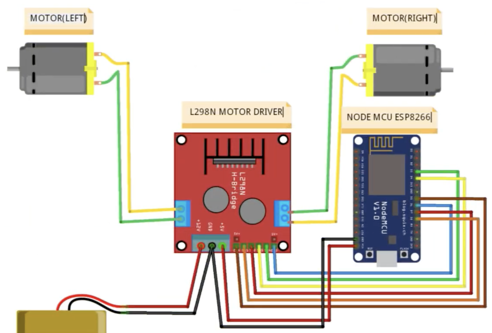
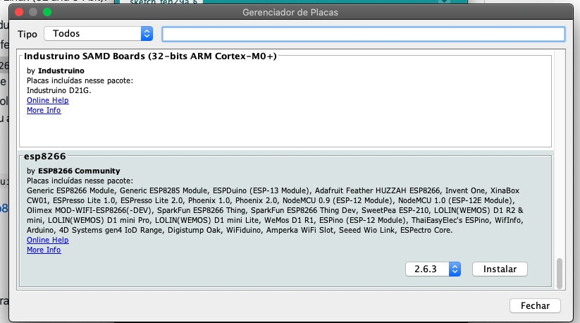
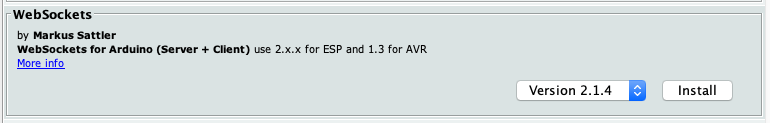

= Setup

= Components Setup

Arduino IDE download https://www.arduino.cc/en/Main/Software

== Drivers

=== Install USB Driver

Download and install CP210x usb-uart

https://www.silabs.com/products/development-tools/software/usb-to-uart-bridge-vcp-drivers

=== Flash NodeMCU Firmware

As the official (https://github.com/nodemcu/nodemcu-firmware/releases) nodemcu-flasher is not maintained and not supported the macOS, should use 3rd-party flasher instead

So download and install .dmg for nodemcu-pyflasher

https://github.com/marcelstoer/nodemcu-pyflasher/releases

=== Install Library Modules

https://github.com/esp8266/Arduino#installing-with-boards-manager

To run this code you need some additional libraries:

* ArduinoJSON